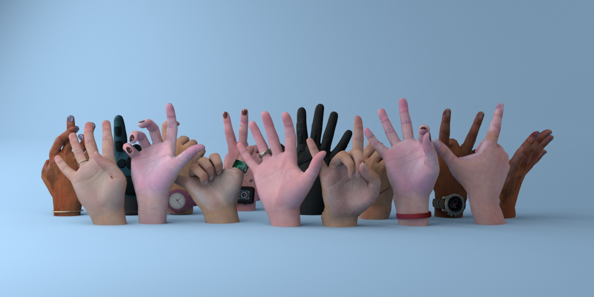

<!-- PROJECT LOGO -->

<p align="center">

  <h1 align="center">DART: Articulated Hand Model with Diverse Accessories and Rich Textures</h1>
  <p align="center">
    <a href="https://tomguluson92.github.io/"><strong>Daiheng Gao</strong><sup>*</sup></a>
    ·
    <a href="https://ps.is.tuebingen.mpg.de/person/yxiu"><strong>Yuliang Xiu</strong><sup>*</sup></a>
    ·
    <a href="https://kailinli.top/#"><strong>Kailin Li</strong><sup>*</sup></a>
    ·
    <a href="https://lixiny.github.io/"><strong>Lixin Yang</strong><sup>*</sup></a>
    ·
    <strong>Feng Wang</strong>
    ·
    <strong>Peng Zhang</strong>
    ·
    <strong>Bang Zhang</strong>
    ·
    <a href="https://www.mvig.org/"><strong>Cewu Lu</strong></a>
   ·
    <a href="https://www.cs.sfu.ca/~pingtan/"><strong>Ping Tan</strong></a>
  </p>
  <h2 align="center">Neurips 2022 (Dataset & Benchmark Track)</h2>
  <div align="center">
    
  </div>

  <p align="center">
  <br>
    <a href="https://pytorch.org/get-started/locally/"></a>
    <br></br>
    <a href='https://arxiv.org/abs/2112.09127'>
      
    </a>
    <a href='https://dart2022.github.io/' style='padding-left: 0.5rem;'>
      
    <a href="https://www.youtube.com/watch?v=kvWqtdLf6hs"></a>
  </p>
</p>

<br />
<br />


# DARTset

This is the toolkit for the DARTset project.

To postprocess the intermediate output yield by DART's GUI, please refer to postprocess folder.

To visualize the data, please follow the instructions:

## Update:

- 2022.09.29: **DART GUI source code open**, please download at [DART's GUI source code](https://drive.google.com/file/d/1xtfc-fMHR5ax-e5S5Drx53Rm2ddL5mHs/view?usp=sharing). ONLY ACADEMIC USAGE ARE ALLOWED!!!

## Environment

Please make sure you have the following dependencies installed:
* numpy
* cv2
* imageio
* pytorch
* pytorch3d (>= 0.6)
* [manotorch](https://github.com/lixiny/manotorch.git)


## Data

Please download the data from [DropBox](https://tinyurl.com/2p875pa3) and put them in the `data/DARTset` folder.

Then download [MANO](https://mano.is.tue.mpg.de) from the official website and put it in the `assets` folder.

Your directory should look like this:

```
.
├── DARTset.py
├── DARTset_utils.py
├── assets
│   └── mano_v1_2
├── data
│   └── DARTset
│       ├── train
│       │   ├── 0
│       │   ├── 0_wbg
│       │   ├── part_0.pkl
│       │   |-- ...
│       └── test
```

## Visualization

```python
python DARTset.py
```

You can modify this [line](https://github.com/DART2022/DARTset/blob/f619f609b1902b344fc5bbba57d080763a5496eb/DARTset.py#L175) in DARTset.py to change the `train/test` data split.
