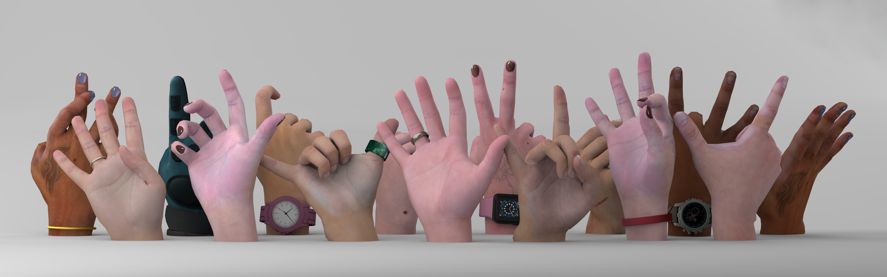

<!-- PROJECT LOGO -->

<p align="center">

  <h1 align="center">DART: Articulated Hand Model with Diverse Accessories and Rich Textures</h1>
  <p align="center">
    <a href="https://tomguluson92.github.io/"><strong>Daiheng Gao</strong><sup>*</sup></a>
    ·
    <a href="https://ps.is.tuebingen.mpg.de/person/yxiu"><strong>Yuliang Xiu</strong><sup>*</sup></a>
    ·
    <a href="https://kailinli.top/#"><strong>Kailin Li</strong><sup>*</sup></a>
    ·
    <a href="https://lixiny.github.io/"><strong>Lixin Yang</strong><sup>*</sup></a>
    <br>
    <strong>Feng Wang</strong>
    ·
    <strong>Peng Zhang</strong>
    ·
    <strong>Bang Zhang</strong>
    ·
    <a href="https://www.mvig.org/"><strong>Cewu Lu</strong></a>
   ·
    <a href="https://www.cs.sfu.ca/~pingtan/"><strong>Ping Tan</strong></a>
  </p>
  <h2 align="center">NeurIPS 2022 (Datasets and Benchmarks Track)</h2><br>
  <div align="center">
    
  </div>

  <p align="center">
  <br>
    <a href='https://arxiv.org/abs/2210.07650'>
      
    </a>
    <a href='https://dart2022.github.io/' style='padding-left: 0.5rem;'>
      
    <a href="https://www.youtube.com/watch?v=kvWqtdLf6hs"></a>
  </p>
</p>

<br />
<br />


## Update

- [2022.10.07] **DART's raw textures+accessories are released** at [RAW](https://drive.google.com/file/d/1_KPzMFjXLHagPhhos7NXvzdzMMN-b1bd/view)
- [2022.09.29] **DART Unity GUI's source code is publicly available** at [GUI](https://drive.google.com/file/d/1xtfc-fMHR5ax-e5S5Drx53Rm2ddL5mHs/view?usp=sharing).

## Environment

* numpy
* cv2
* imageio
* PyTorch
* PyTorch3D (>= 0.6)
* [manotorch](https://github.com/lixiny/manotorch.git)


## Data

Please download the data from [DropBox](https://www.dropbox.com/sh/aosmkomcm4sznsc/AADyr7gkki5uszg44Riv0nZ5a?dl=0) or [Baidu Pan (4w3r)](https://pan.baidu.com/share/init?surl=xOV3FkNFxNS-mYrHTXd8Iw) and put them in the `data/DARTset` folder.

Then download [MANO](https://mano.is.tue.mpg.de) from the official website and put it in the `assets` folder.

Your directory should look like this:

```
.
├── DARTset.py
├── DARTset_utils.py
├── assets
│   └── mano_v1_2
├── data
│   └── DARTset
│       ├── train
│       │   ├── 0
│       │   ├── 0_wbg
│       │   ├── part_0.pkl
│       │   |-- ...
│       └── test
```

## Visualization

```python
python DARTset.py
```

You can modify this [line](https://github.com/DART2022/DARTset/blob/f619f609b1902b344fc5bbba57d080763a5496eb/DARTset.py#L175) in DARTset.py to change the `train/test` data split.

## Post Processing with Unity GUI

Please check [postprocess folder](postprocess/README.md) to learn how to generate intermediate output using DART's Unity GUI.

## Citation

If you find our work useful in your research, please cite:

```
@inproceedings{gao2022dart,
    title={{DART: Articulated Hand Model with Diverse Accessories and Rich Textures}},
    author={Daiheng Gao and Yuliang Xiu and Kailin Li and Lixin Yang and Feng Wang and Peng Zhang and Bang Zhang and Cewu Lu and Ping Tan},
    booktitle={Thirty-sixth Conference on Neural Information Processing Systems Datasets and Benchmarks Track},
    year={2022},
}

```
